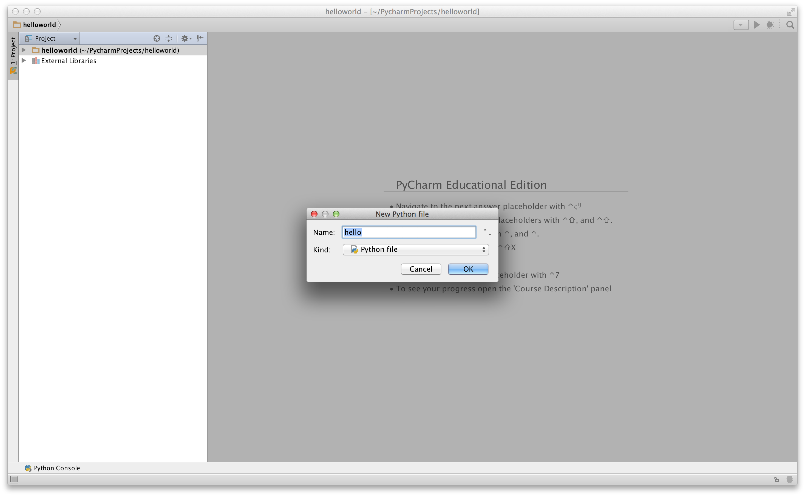
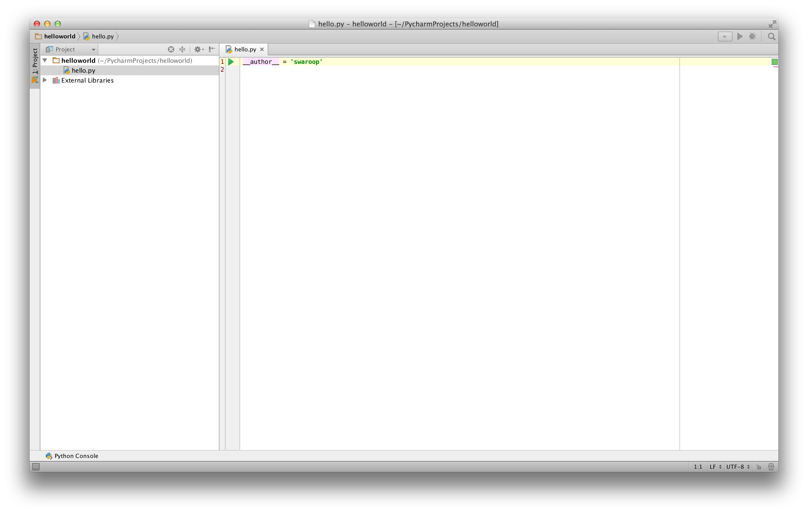

# Перші Кроки

Тепер ми побачимо, як запустити традиційну програму "Hello World" на Python. Це навчить вас писати, зберігати і запускати програми Python.

Є два способи використання Python для запуску програми - за допомогою інтерактивного інтерпретатора або з допомогою вихідного файлу. Зараз ми побачимо, як використовувати обидва ці методи.

## Використання Підказки Інтерпретатора

Відкрийте термінал в операційній системі (як описано раніше в розділі [Установка] (./installation.md#installation), а потім відкрийте Python, ввівши "python3" і натиснувши клавішу `[enter]`.

Після того, як ви запустили Python, ви повинні побачити `>>>`, де ви можете почати вводити матеріал. Це називається _python interpreter prompt_.

В інтерпретатор Python в командному рядку введіть:

```python
print("Hello World")
```

далі натиснути клавішу `[enter]`. Ви повинні побачити слова "Hello World", надруковані на екрані.

Ось приклад того, що ви повинні бачити, при використанні комп'ютера Mac. Подробиці про програмне забезпечення Python будуть відрізнятися в залежності від вашого комп'ютера, але частина з запрошення (тобто від `>>>` і далі) має бути однаковою незалежно від операційної системи.

<!-- The output should match pythonVersion variable in book.json -->
```python
$ python3
Python 3.6.0 (default, Jan 12 2017, 11:26:36)
[GCC 4.2.1 Compatible Apple LLVM 8.0.0 (clang-800.0.38)] on darwin
Type "help", "copyright", "credits" or "license" for more information.
>>> print("Hello World")
Hello World
```

Зверніть увагу, що Python дає вам рузультат виконання рядка негайно! Ви тільки що ввели олин _вираз_ на мові Python. Ми використовуємо `print` для друку будь-якого значення, яке ви йому надаєте. Тут ми поставляємо текст "Hello World", і він швидко друкується на екрані.

### Як вийти з запрошення інтерпретатора

Якщо ви використовуєте оболонку GNU/Linux або OS X, ви можете вийти з  інтерпретатора, натиснувши `[ctrl + d]` або ввівши `exit ()` (примітка: не забудьте включити круглі дужки `()`), а потім натисніть клавішу `[enter]`.

Якщо ви використовуєте командний рядок Windows, натисніть `[ctrl + z]`, а потім клавішу `[enter]`.

## Вибір Редактора

Ми не можемо друкувати програму зразу у інтерпретатора кожен раз, коли ми хочемо щось запустити, тому ми повинні зберігати їх у файлах і толі ми зможемо запускати наші програми будь-яку кількість разів.

Щоб створити вихідні файли Python, нам потрібен редактор, де ви можете ввести текст і зберегти його. Хороший редактор зробить ваше життя програміста простішим. Отже, вибір редактора дійсно має вирішальне значення. Ви повинні вибрати редактор, як Ви б вибрати автомобіль, який ви хотіли б купити. Хороший редактор допоможе вам легко писати програми на Python, що робить вашу подорож більш комфортним і допоможе вам досягти вашої мети набагато швидше і безпечніше.

Одним з основних вимог це _виділення синтаксису_, де всі різні частини вашої програми Python розмальовані так, що ви можете _бачити_ вашу програму і візуалізувати її роботу.

Якщо ви не знаєте, з чого почати, я б рекомендував використовувати [PyCharm Educational Edition] (https://www.jetbrains.com/pycharm-edu/) це програмне забезпечення, яке доступне на Windows, Mac OS X і Linux. Подробиці в наступному розділі.

Якщо ви використовуєте Windows, *не використовуйте Notepad(блокнот)* - це поганий вибір, тому що він не робить підсвічування синтаксису, а також головне він не підтримує відступи тексту, що дуже важливо в нашому випадку, як ми побачимо пізніше. Хороші редактори будуть робити це автоматично.

Якщо ви досвідчений програміст, то ви повинні використовувати [Vim] (http://www.vim.org) або [Emacs] (http://www.gnu.org/software/emacs/). Зайве говорити, що це два з найбільш потужних редакторів, і ви виграєте від їх використання для написання програм на Python. Я особисто використовую обидва для більшості моїх програм і навіть написав [цілу книгу по Vim]({{ book.vimBookUrl }}).

Якщо ви готові витратити час на вивчення Vim або Emacs, я рекомендую вам навчитися використовувати будь-який з них, оскільки це буде дуже корисно для вас у довгостроковій перспективі. Однак, як я вже згадував раніше, новачки можуть почати з PyCharm і зосередитися на вивченні Python, а не на Редакторі в даний момент.

Хочу повторити, будь ласка, виберіть правильний редактор - це може зробити написання програм Python більш захоплюючим і легким.

## PyCharm {#pycharm}

[PyCharm Educational Edition](https://www.jetbrains.com/pycharm-edu/) це безкоштовний редактор, який ви можете використовувати для написання програм на Python.

Коли ви відкриєте PyCharm, ви побачите це, натисніть `Створити новий проект` (`Create New Project`):


Виберіть `Чистий Python` (`Pure Python`):


Змініть `без назви` (`untitled`) на `hello world` як місце розташування проекту, ви повинні побачити деталі, подібні до цього:


Натисніть кнопку `Створити`(`create`).

Клацніть правою кнопкою миші на `helloworld` в бічній панелі і виберіть `New` - > `Python File`:


Вам буде запропоновано ввести ім'я, типу `Привіт` (`hello`):



Тепер ви можете побачити файл, відкритий для вас:



Видаліть вже наявні рядки і введіть наступну команду:

<!-- TODO: Update screenshots for Python 3 -->

```python
print("hello world")
```

Тепер клацніть правою кнопкою миші на те, що ви набрали (без виділення тексту), і натисніть на кнопку `Виконати " привіт"` (`Run 'hello'`).


Тепер ви повинні побачити висновок (що він друкує) вашої програми:


Фу! Це було доситатньо багато кроків, щоб почати роботу, але надалі, кожен раз, коли ми просимо Вас створити новий файл, не забудьте просто клацнути правою кнопкою миші на "helloworld" зліва- > "новий" - > `Python File`  (-> `New` -> `Python File`)і продовжити ті ж кроки, щоб створити та запустити, як показано вище.

Ви можете знайти більш детальну інформацію про PyCharm в [PyCharm Quickstart] (https://www.jetbrains.com/pycharm-educational/quickstart/).

## Vim

1. Встановити [Vim] (http://www.vim.org)
    * Користувачі Mac OS X повинні встановити пакет macvim через [HomeBrew] (http://brew.sh/)
    * Користувачі Windows повинні завантажити "самоустановлювальні виконуваний файл" з веб-сайту [Vim](http://www.vim.org/download.php)
    * Користувачі GNU/Linux повинні отримати Vim з репозиторіїв свого дистрибутива, наприклад, користувачі Debian і Ubuntu можуть встановити пакет vim.
2. Встановити [jedi-vim] (https://github.com/davidhalter/jedi-vim) плагін для автозаповнення.
3. Встановіть відповідний пакет python `jedi`: `pip install -U jedi`

## Emacs

1. Установка [Emacs 24+] (http://www.gnu.org/software/emacs/).
    * Користувачі Mac OS X повинні отримувати Emacs http://emacsformacosx.com
    * Користувачі Windows повинні отримувати Emacs http://ftp.gnu.org/gnu/emacs/windows/
    * Користувачі GNU/Linux повинні отримати Emacs з репозиторіїв свого дистрибутива, наприклад, користувачі Debian і Ubuntu можуть встановити пакет `emacs24`.
2. Встановити [ELPY] (https://github.com/jorgenschaefer/elpy/wiki)

## Використання Вихідного Файлу

Тепер повернемося до програмування. Існує традиція, що всякий раз, коли ви вивчаєте нову мову програмування, першою програмою, яку ви пишете і запускаєте, є програма "Hello World" - Все, що вона робить, це просто говорить "Привіт Світе", коли ви запускаєте. Як говорить Саймон Козенс[^1], це " традиційне заклинання для богів програмування, щоб допомогти вам краще вивчити мову."

Почніть свій вибір редактора, введіть наступну програму і збережіть її як `hello.py".

Якщо ви використовуєте PyCharm, ми вже обговорювали, [як працювати з вихідним файлом](#pycharm).

Для інших редакторів відкрийте новий файл `hello.py` і наберіть це.:

```python
print("hello world")
```

Де ви повинні зберегти файл? В будь-яку папку, розташування якої ви знаєте. Якщо ви
не розумію, що це означає створить нову папку і використовуйте її для збереження і запуску всіх
програм на Python :

- `/tmp/py` на Mac OS X
- `/tmp/py` на GNU/Linux
- `C:\py` на Windows

Для створення зазначеної вище папки використовуйте команду `mkdir` в терміналі, наприклад "mkdir /tmp/py".

>**Примітка від автора перекладу**
>
>Якщо ви використовуєте Mac OS чи Linux , то створити нову папку за допомогою терміналу, ви можете ввісши наступну команду `mkdir foldername` де foldername це імя вашої папки

Важливо: завжди переконуйтеся, що ви даєте йому розширення файлу `.py`, наприклад, `foo.py`.

Щоб запустити програму Python:

1. Відкрийте вікно терміналу (див. попередню [установку](./installation.md#installation) глава про те, як це зробити)
2. **З** мініть **П**апку, де ви зберегли файл, наприклад, `cd/tmp/py`
3. Запустіть програму, ввівши команду `python hello.py`. Вихідні дані, як показано нижче.

```
$ python hello.py
hello world
```


Якщо ви отримали результат, як показано вище, вітаємо! - ви успішно запустили свою першу програму Python. Ви успішно подолали найскладнішу частину вивчання програмування, яка полягає в тому, щоб почати роботу з вашою першою програмою!

У разі, якщо ви отримали помилку, введіть вищевказану програму _точнісінько_  так, як показано вище, і запустіть програму знову. Зверніть увагу, що Python чутливий до регістру, тобто `print` не те ж саме, що `Print` -зверніть увагу на нижній регістр ` p` в першому і верхній регістр `P` у другому. Крім того, переконайтеся, що перед першим символом в кожному рядку немає бути пропусків або вкладок - ми побачимо [чому це важливо](./basics.md#indentation) пізніше.

** Як Це Працює**

Програма Python складається з _виразів_. У нашій першій програмі у нас є тільки одне твердження. У нашій програмі ми викликаємо `print`, якому ми передаємо текст "hello world".

## отримувати допомогу

Якщо вам потрібна швидка інформація про будь-якої функції або інструкції в Python, то ви можете використовувати вбудовану функціональність `help`. Це дуже корисно, особливо при використанні підказки інтерпретатора. Наприклад, запустіть `help (`lan`) ` - це відобразить довідку для функції `len`, яка використовується для підрахунку кількості елементів.

Порада: натисніть `q`, щоб вийти з довідки.

Аналогічно, ви можете отримати інформацію практично про що завгодно в Python. Використовуйте `help ()`, щоб дізнатися більше про використання самого `help`!

У випадку, якщо вам потрібно отримати довідку про оператор, такий як `return`, вам потрібно помістити  його в лапки, такі як `help('return')`, щоб Python не заплутався в тому, що ми намагаємося зробити.

## Резюме

Тепер ви зможете писати, зберігати і запускати програми Python.

Тепер, коли ви є користувачем Python, давайте дізнаємося ще кілька концепцій Python.

---

[^1]: Автор дивовижної книги 'Початок Perl' ('Beginning Perl')